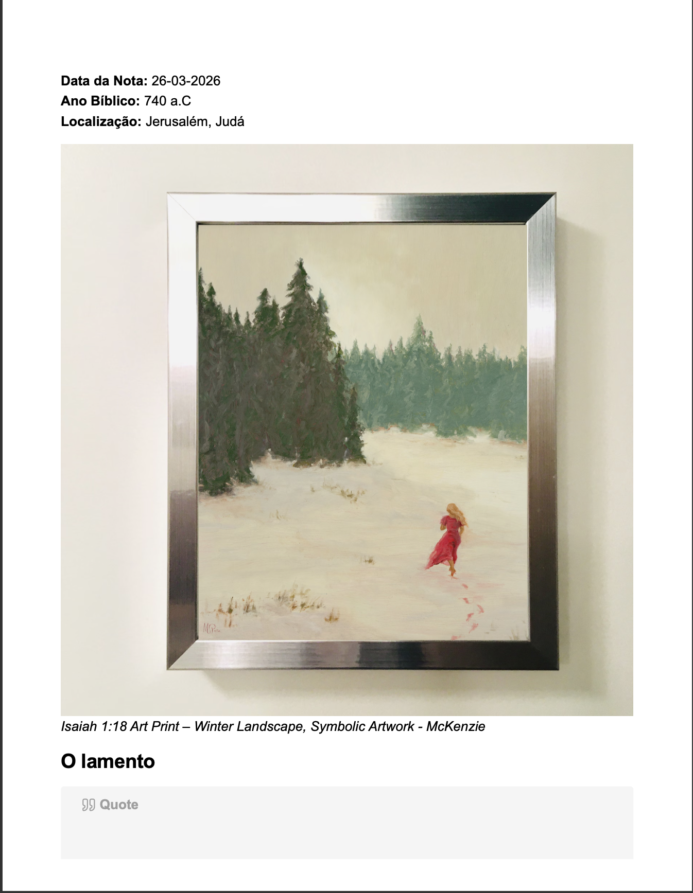
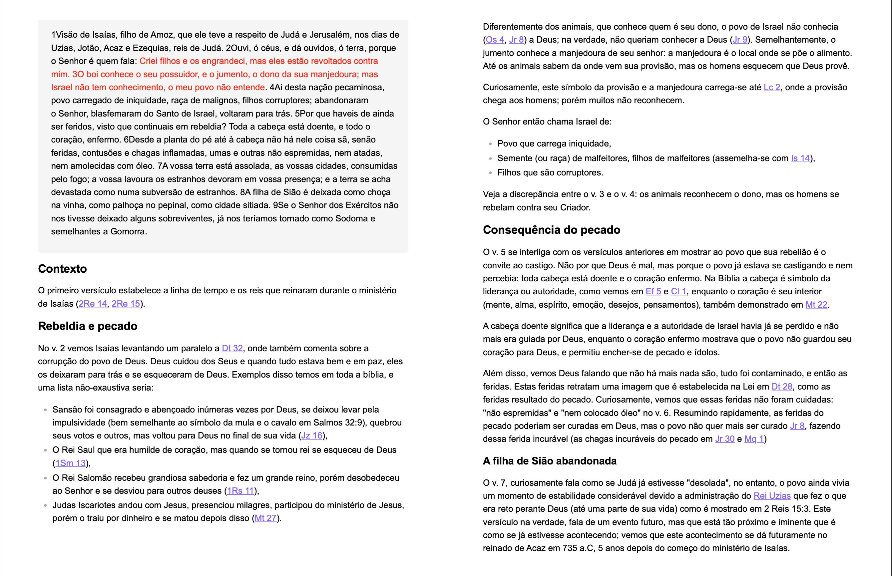

# 📖 EstudoBiblia

> **⚠️ Aviso importante:** Este repositório não é obra de um teólogo, pastor, doutor em divindade, nem de ninguém com qualquer autoridade acadêmica ou eclesiástica. É simplesmente o caderno digital de uma pessoa curiosa que gosta de estudar a Bíblia **por puro prazer e devoção pessoal**. Erros, lacunas e interpretações amadoras são esperados — e bem-vindos como parte do processo de aprendizado. Leia com esse espírito em mente. 😄

---

##  O que é este repositório?

O **EstudoBiblia** é um cofre ([vault](https://help.obsidian.md/Getting+started/Create+a+vault)) para o [Obsidian](https://obsidian.md/), organizado como um sistema pessoal de notas e exegese bíblica. O objetivo é registrar estudos dos livros da Bíblia de forma estruturada, conectada e pesquisável — aproveitando ao máximo os recursos de links internos, metadados e visualizações do Obsidian.

Pense nisso como um **jardim digital de notas bíblicas**: algo que cresce de forma orgânica, sem compromisso de ser completo ou academicamente rigoroso, mas com intenção de ser útil para quem estuda.

---

## Screenshots





---

## Motivação

A leitura bíblica costuma ser solitária e sem registro. Com o tempo, interpretações, contextos históricos, paralelos entre passagens e insights acabam se perdendo. Este projeto nasceu da vontade de:

- Registrar estudos sem perder o fio da meada entre os livros;
- Conectar passagens do Antigo e do Novo Testamento de forma visual;
- Organizar informações históricas e contextuais (autor, ano, língua original, destinatários, gênero literário) de forma consultável;
- Ter um espaço pessoal de reflexão que possa ser compartilhado com quem tiver interesse.

---

##  Estrutura do repositório

```
EstudoBiblia/
├── 1VT/                  # Notas sobre os livros do Velho Testamento
├── 2NT/                  # Notas sobre os livros do Novo Testamento
├── pictures/             # Imagens e ilustrações usadas nas notas
├── Bíblia Meta.base      # Banco de metadados para o plugin Bases do Obsidian
└── README.md             # Este arquivo
```

### `1VT/` — Velho Testamento

Pasta contendo notas individuais dos livros do Antigo Testamento. Cada livro pode ter uma ou mais notas cobrindo introdução, contexto histórico, estrutura literária e análise de passagens.

### `2NT/` — Novo Testamento

Pasta equivalente para os livros do Novo Testamento, com o mesmo padrão de organização.

### `Bíblia Meta.base`

Este arquivo é o coração da organização do vault. Ele configura uma **visão em tabela** (usando o plugin [Bases](https://obsidian.md/plugins?id=bases)) com os seguintes metadados para cada nota de livro:

|Campo|Descrição|
|---|---|
|`ano`|Ano aproximado de escrita do livro|
|`localizacao`|Local de escrita ou contexto geográfico|
|`autor`|Autor atribuído ao livro|
|`lingua`|Língua original (Hebraico, Aramaico, Grego)|
|`destinatarios`|A quem o livro foi dirigido|
|`Gênero Macro`|Gênero literário amplo (ex: Histórico, Poético, Profético, Epistolar)|
|`Gênero Específico`|Subgênero mais detalhado|
|`Sub-Tipo`|Classificação adicional quando necessário|
|`Novo ou Velho Testamento`|Fórmula calculada automaticamente pela pasta do arquivo|

A tabela é ordenada por ano, localização, língua e destinatários, permitindo uma visão cronológica e geográfica de toda a Bíblia de uma vez.

---

## 🧩 Como usar no Obsidian

### 1. Pré-requisitos

- [Obsidian](https://obsidian.md/) instalado (gratuito)
- Plugin **Bases** habilitado (nativo no Obsidian 1.8+, ou instale via _Community Plugins_)

### 2. Clonar o repositório

```bash
git clone https://github.com/hytalo-bassi/EstudoBiblia.git
```

Ou baixe como `.zip` clicando em **Code → Download ZIP** no GitHub.

### 3. Abrir como vault no Obsidian

1. Abra o Obsidian
2. Clique em **"Abrir pasta como cofre"** (_Open folder as vault_)
3. Selecione a pasta `EstudoBiblia/` que você clonou/extraiu
4. Pronto! O vault estará configurado com todas as notas e metadados

### 4. Navegando pelo vault

- Use o **Painel de arquivos** para navegar entre `1VT/` e `2NT/`
- Abra o arquivo `Bíblia Meta.base` para ver a **tabela geral** com todos os livros e seus metadados
- Use `Ctrl+O` (ou `Cmd+O` no Mac) para buscar qualquer nota por nome
- Use `Ctrl+Shift+F` para busca de texto em todo o vault
- Explore os **links internos** (`[[link]]`) para navegar entre passagens relacionadas

---

## 📣 Como usar para preparar sermões

Mesmo sendo um projeto de estudos pessoais e não acadêmicos, as notas podem ser um bom ponto de partida para quem quer preparar uma mensagem. Aqui vai um fluxo sugerido:

### Passo 1 — Identifique o livro e o contexto

Abra a tabela no `Bíblia Meta.base` e filtre pelo livro de interesse. Você terá rapidamente: autor, destinatários, ano e gênero literário — informações essenciais para qualquer introdução de sermão.

### Passo 2 — Leia as notas do livro

Navegue até a pasta `1VT/` ou `2NT/` e abra a nota do livro. Procure por contexto histórico, divisões do livro e temas centrais já identificados.

### Passo 3 — Use os links internos como fios temáticos

As notas podem conter `[[links]]` para passagens paralelas ou temas que aparecem em outros livros. Siga esses links para enriquecer a mensagem com o contexto mais amplo da narrativa bíblica.

### Passo 4 — Crie suas próprias notas

Crie uma nova nota no Obsidian (ex: `Sermão - João 3.16.md`) e use as notas existentes como referência. Linke de volta (`[[João]]`, por exemplo) para manter tudo conectado.

### Passo 5 — Use o grafo para visualizar conexões

Abra a **Visão de Grafo** (`Ctrl+G`) para ver visualmente como os temas, livros e passagens se conectam — ótimo para encontrar ângulos inesperados para uma mensagem.

> **Lembrete:** As notas aqui são um ponto de partida, não uma fonte definitiva. Consulte sempre comentários bíblicos, dicionários teológicos e, acima de tudo, o próprio texto sagrado com oração e discernimento.

---

## 🤝 Como contribuir

Contribuições são muito bem-vindas! Este é um projeto aberto e colaborativo — quanto mais perspectivas, melhor.

### Formas de contribuir

**1. Adicionar notas de livros ainda não cobertos** Se um livro da Bíblia ainda não tem nota na pasta `1VT/` ou `2NT/`, você pode criar uma seguindo o padrão dos arquivos existentes, com os metadados no frontmatter YAML:

```yaml
---
ano: 
localizacao: 
autor: 
lingua: 
destinatarios: 
Gênero Macro: 
Gênero Específico: 
Sub-Tipo: 
---
```

**2. Enriquecer notas existentes** Adicione contexto histórico, paralelos com outros livros, notas sobre o gênero literário, ou links para passagens relacionadas.

**3. Corrigir erros** Encontrou uma data errada, um autor incorreto ou uma interpretação equivocada? Abra uma _Issue_ ou envie um _Pull Request_ explicando a correção.

**4. Adicionar imagens e mapas** A pasta `pictures/` aceita imagens históricas, mapas do mundo bíblico e qualquer ilustração que enriqueça o estudo.

### Fluxo de contribuição

```bash
# 1. Fork o repositório no GitHub
# 2. Clone o seu fork
git clone https://github.com/SEU_USUARIO/EstudoBiblia.git

# 3. Crie uma branch para sua contribuição
git checkout -b minha-contribuicao

# 4. Faça as alterações no Obsidian ou em seu editor favorito

# 5. Commit e push
git add .
git commit -m "Adiciona nota sobre o livro de Rute"
git push origin minha-contribuicao

# 6. Abra um Pull Request no GitHub explicando o que foi feito
```


### Sobre denominações`

Estas notas foram feitas para serem lidas à luz da Escritura puramente, usando toda a Bíblia como sua própria fonte de interpretação. O ideal é que o conteúdo **não seja enviesado para nenhuma denominação cristã** — seja presbiteriana, assembleiana ou qualquer outra. O foco está no texto e no seu contexto histórico-literário, não em tradições confessionais específicas.`

### Sobre a tradução utilizada`

As notas utilizam essencialmente a **NVI (Nova Versão Internacional)**. Em alguns momentos, pode ser necessário consultar o texto original com o auxílio da [Concordância de Strong](https://pt.wikipedia.org/wiki/Concordância_de_Strong) para compreender nuances de palavras em Hebraico ou Grego.`

### Boas práticas

- Mantenha o padrão de frontmatter YAML nos arquivos de livros
- Use links internos (`[[Nome do Livro]]`) para conectar ideias
- Prefira ser honesto sobre incertezas ("possivelmente", "alguns estudiosos apontam") a afirmar com falsa certeza.
- Link as afirmações extra-bíblicas com fontes confiáveis.
- Este não é um espaço para debates doutrinários — foque no texto e no contexto

---

## 🛠️ Plugins Obsidian recomendados

Para aproveitar ao máximo este vault, considere instalar os seguintes plugins:

| Plugin                  | Para quê serve                                        |
| ----------------------- | ----------------------------------------------------- |
| **Bases** (nativo 1.8+) | Visualizar a tabela de metadados (`Bíblia Meta.base`) |
| **Dataview**            | Consultas dinâmicas nas notas (alternativa ao Bases)  |
| **Git**                 | Integração com o Git no Obsidian                      |


---

## ⚖️ Licença e uso

Este conteúdo é disponibilizado livremente para uso pessoal, estudo e preparação de mensagens. Não há restrições — compartilhe, adapte e use como quiser. Uma menção ao repositório original é sempre gentil, mas não obrigatória.

---

##  Sobre o autor

Apenas alguém que gosta de ler a Bíblia, tomar notas e organizar ideias. Se você chegou até aqui, provavelmente tem o mesmo gosto — e isso já é motivo suficiente para a gente se entender. 

---

_"Toda a Escritura é inspirada por Deus e útil para o ensino, para a repreensão, para a correção e para a instrução na justiça."_ — 2 Timóteo 3:16
